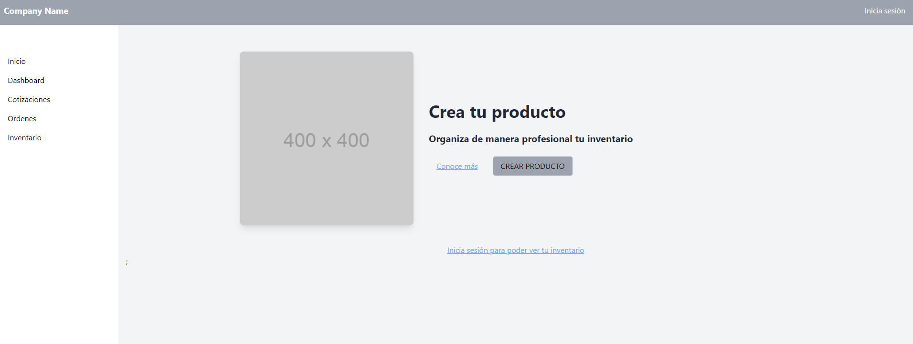

# Proyecto React con TypeScript y Vite

Este es un proyecto de ejemplo que utiliza React, TypeScript y Vite para el Marketplace de una compañia

## Características

- **React**: Biblioteca de JavaScript para construir interfaces de usuario.
- **TypeScript**: Un superset de JavaScript que añade tipado estático.
- **Vite**: Herramienta de construcción rápida para el desarrollo y la construcción de proyectos.
- **Tailwind**:
- **Redux**:

## Instalación

1. **Clonar el repositorio**:

   ```bash
   git clone https://github.com/Developerproject2024/app-marketplace-ui.git
   cd app-marketplace-ui
   $ npm install
   $ npm run dev
   ```

2. **Roles**:

- **Administrador**: rol que pemrite visualizar todos los productos del marketpave y realizar filtros
- **Vendedor**: rol para crear productos
- **Comprador**: rol que permite ver todos los productos

3. **Manual de Usuario por Rol**:

- **Comprador**:
  

- **Vendedor**: usuario que necesita iniciar sesion

  

  Click en el boton crear producto

  

Modal con opciones para iniciar sesion o registrarse


Iniciar esion


clic botn registrar


- **Administrador**: usuario que necesita iniciar sesion
  Clic boton de la barra superior a la derecha
  


clic botn inicia sesión

2. **Usuario de prueba de Administrador**:

```bash
   email: admin@admin.com
   contraseña: 1

```
